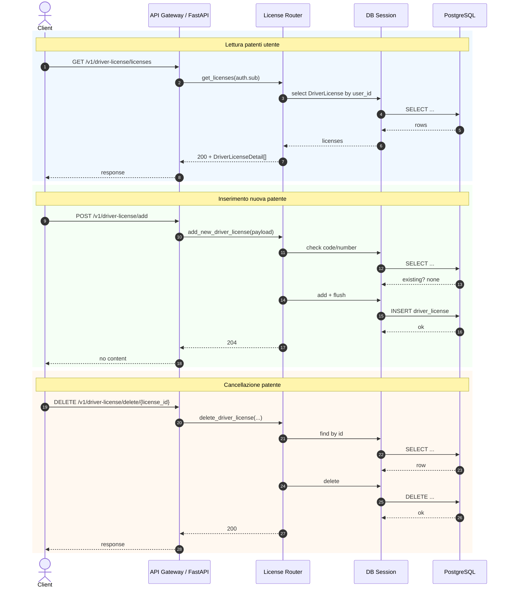

# Diagramma Di Frequenza (Sequenza) - Driver License

Interpretazione usata: "frequenza" come flusso/sequenza delle chiamate principali.

```mermaid
sequenceDiagram
  autonumber
  actor Client
  participant API as API Gateway / FastAPI
  participant Router as License Router
  participant DB as DB Session
  participant PG as PostgreSQL

  rect rgb(240, 248, 255)
    note over Client,PG: Lettura patenti utente
    Client->>API: GET /v1/driver-license/licenses
    API->>Router: get_licenses(auth.sub)
    Router->>DB: select DriverLicense by user_id
    DB->>PG: SELECT ...
    PG-->>DB: rows
    DB-->>Router: licenses
    Router-->>API: 200 + DriverLicenseDetail[]
    API-->>Client: response
  end

  rect rgb(245, 255, 245)
    note over Client,PG: Inserimento nuova patente
    Client->>API: POST /v1/driver-license/add
    API->>Router: add_new_driver_license(payload)
    Router->>DB: check code/number
    DB->>PG: SELECT ...
    PG-->>DB: existing? none
    Router->>DB: add + flush
    DB->>PG: INSERT driver_license
    PG-->>DB: ok
    Router-->>API: 204
    API-->>Client: no content
  end

  rect rgb(255, 248, 240)
    note over Client,PG: Cancellazione patente
    Client->>API: DELETE /v1/driver-license/delete/{license_id}
    API->>Router: delete_driver_license(...)
    Router->>DB: find by id
    DB->>PG: SELECT ...
    PG-->>DB: row
    Router->>DB: delete
    DB->>PG: DELETE ...
    PG-->>DB: ok
    Router-->>API: 200
    API-->>Client: response
  end
```
