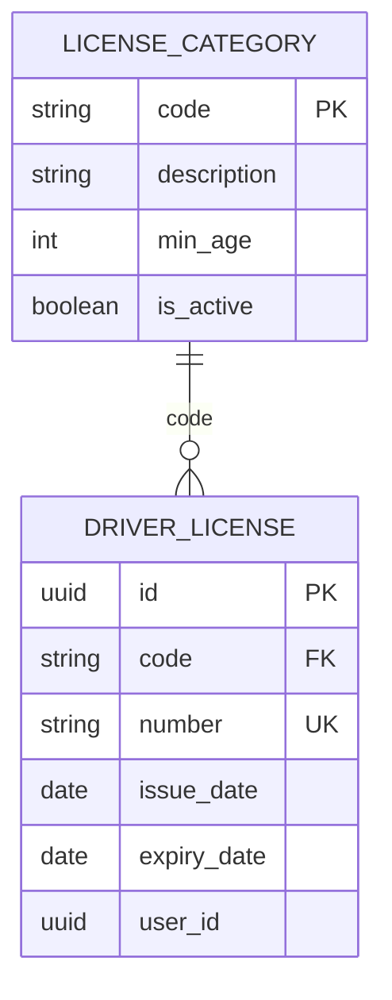

# ER Diagram - Driver License Service

Questo file usa **Mermaid** in notazione ER.

```mermaid
erDiagram
  LICENSE_CATEGORY ||--o{ DRIVER_LICENSE : "code"

  LICENSE_CATEGORY {
    string code PK
    string description
    int min_age
    boolean is_active
  }

  DRIVER_LICENSE {
    uuid id PK
    string code FK
    string number UK
    date issue_date
    date expiry_date
    uuid user_id
  }
```
