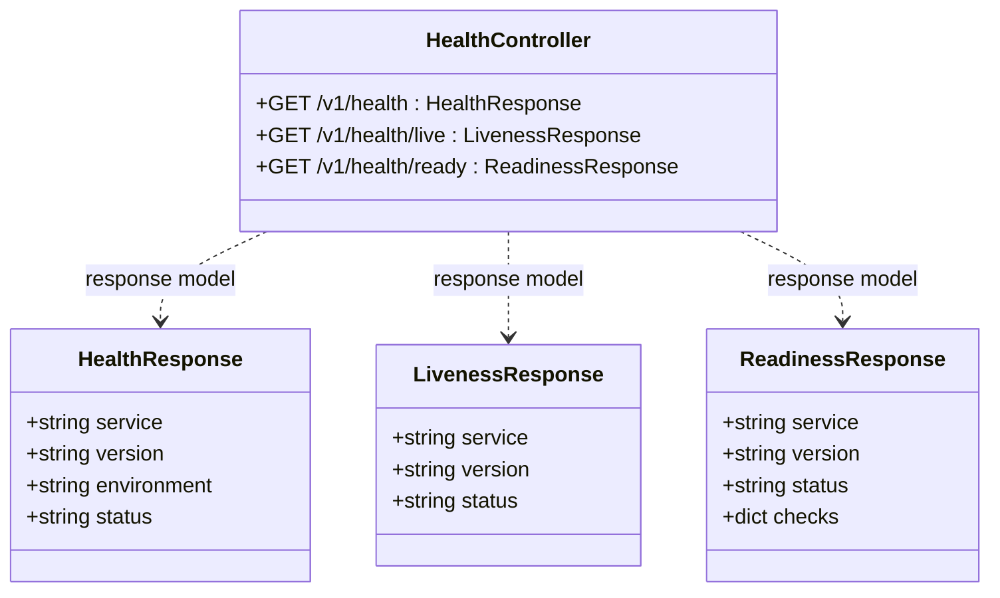

# Diagramma delle classi per identity/v1/health

```mermaid
classDiagram
  class HealthResponse {
    +string service
    +string version
    +string environment
    +string status
  }

  class LivenessResponse {
    +string service
    +string version
    +string status
  }

  class ReadinessResponse {
    +string service
    +string version
    +string status
    +dict checks
  }

  class HealthController {
    +GET /v1/health : HealthResponse
    +GET /v1/health/live : LivenessResponse
    +GET /v1/health/ready : ReadinessResponse
  }

  HealthController ..> HealthResponse : response model
  HealthController ..> LivenessResponse : response model
  HealthController ..> ReadinessResponse : response model
```
