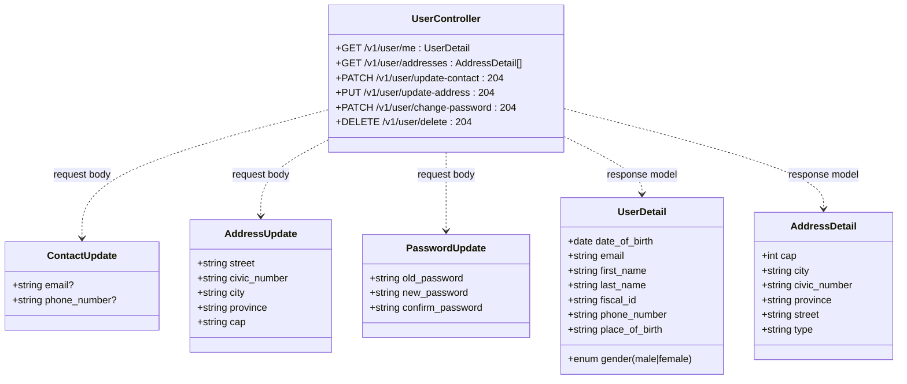

# Diagramma delle classi per identity/v1/user

```mermaid
classDiagram
  class ContactUpdate {
    +string email?
    +string phone_number?
  }

  class AddressUpdate {
    +string street
    +string civic_number
    +string city
    +string province
    +string cap
  }

  class PasswordUpdate {
    +string old_password
    +string new_password
    +string confirm_password
  }

  class UserDetail {
    +date date_of_birth
    +string email
    +string first_name
    +string last_name
    +string fiscal_id
    +enum gender(male|female)
    +string phone_number
    +string place_of_birth
  }

  class AddressDetail {
    +int cap
    +string city
    +string civic_number
    +string province
    +string street
    +string type
  }

  class UserController {
    +GET /v1/user/me : UserDetail
    +GET /v1/user/addresses : AddressDetail[]
    +PATCH /v1/user/update-contact : 204
    +PUT /v1/user/update-address : 204
    +PATCH /v1/user/change-password : 204
    +DELETE /v1/user/delete : 204
  }

  UserController ..> ContactUpdate : request body
  UserController ..> AddressUpdate : request body
  UserController ..> PasswordUpdate : request body
  UserController ..> UserDetail : response model
  UserController ..> AddressDetail : response model
```
