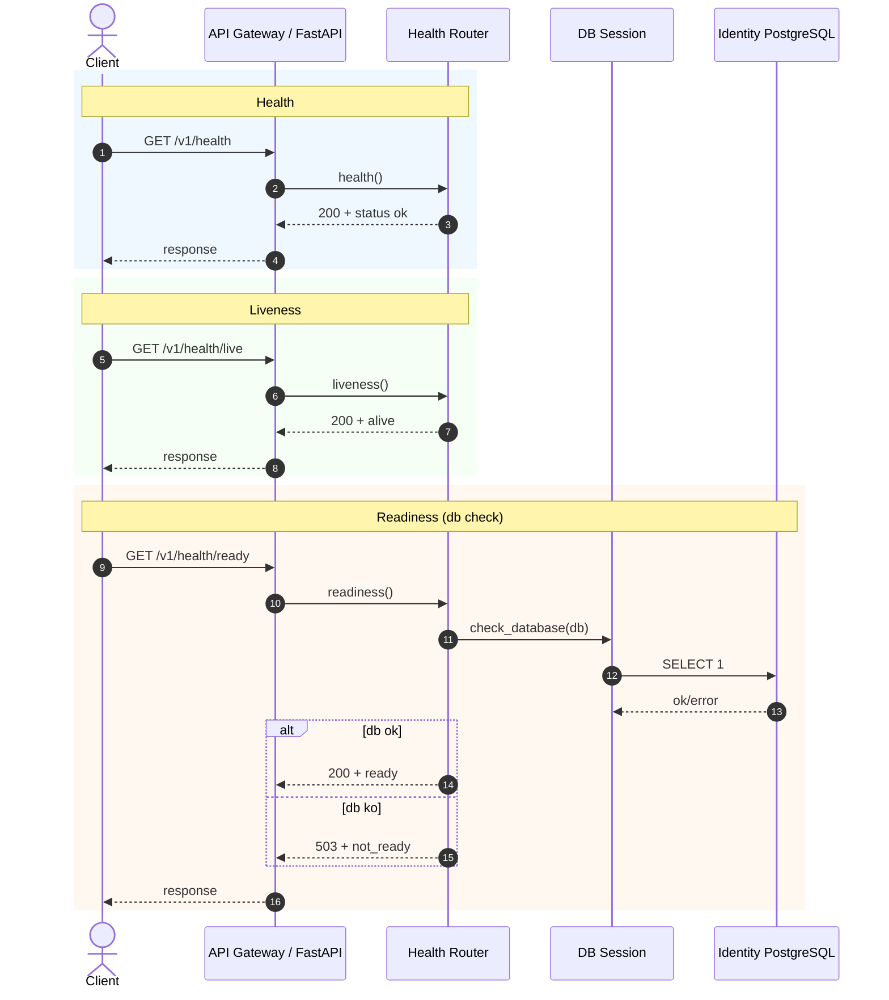

# Diagramma di frequenza per identity/v1/health

```mermaid
sequenceDiagram
  autonumber
  actor Client
  participant API as API Gateway / FastAPI
  participant Health as Health Router
  participant DB as DB Session
  participant IDDB as Identity PostgreSQL

  rect rgb(240, 248, 255)
    note over Client,Health: Health
    Client->>API: GET /v1/health
    API->>Health: health()
    Health-->>API: 200 + status ok
    API-->>Client: response
  end

  rect rgb(245, 255, 245)
    note over Client,Health: Liveness
    Client->>API: GET /v1/health/live
    API->>Health: liveness()
    Health-->>API: 200 + alive
    API-->>Client: response
  end

  rect rgb(255, 248, 240)
    note over Client,IDDB: Readiness (db check)
    Client->>API: GET /v1/health/ready
    API->>Health: readiness()
    Health->>DB: check_database(db)
    DB->>IDDB: SELECT 1
    IDDB-->>DB: ok/error
    alt db ok
      Health-->>API: 200 + ready
    else db ko
      Health-->>API: 503 + not_ready
    end
    API-->>Client: response
  end
```
