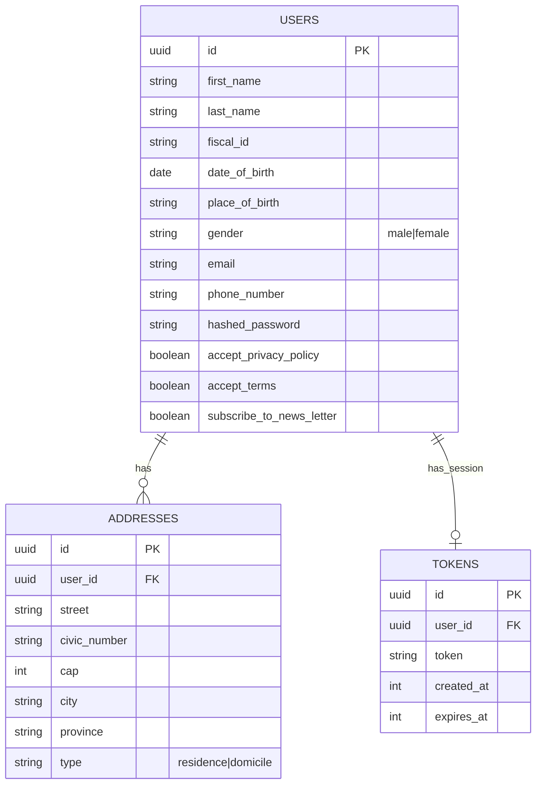

# Diagramma ER - Identity Service

```mermaid
erDiagram
  USERS ||--o{ ADDRESSES : has
  USERS ||--o| TOKENS : has_session

  USERS {
    uuid id PK
    string first_name
    string last_name
    string fiscal_id
    date date_of_birth
    string place_of_birth
    string gender "male|female"
    string email
    string phone_number
    string hashed_password
    boolean accept_privacy_policy
    boolean accept_terms
    boolean subscribe_to_news_letter
  }

  ADDRESSES {
    uuid id PK
    uuid user_id FK
    string street
    string civic_number
    int cap
    string city
    string province
    string type "residence|domicile"
  }

  TOKENS {
    uuid id PK
    uuid user_id FK
    string token
    int created_at
    int expires_at
  }
```
