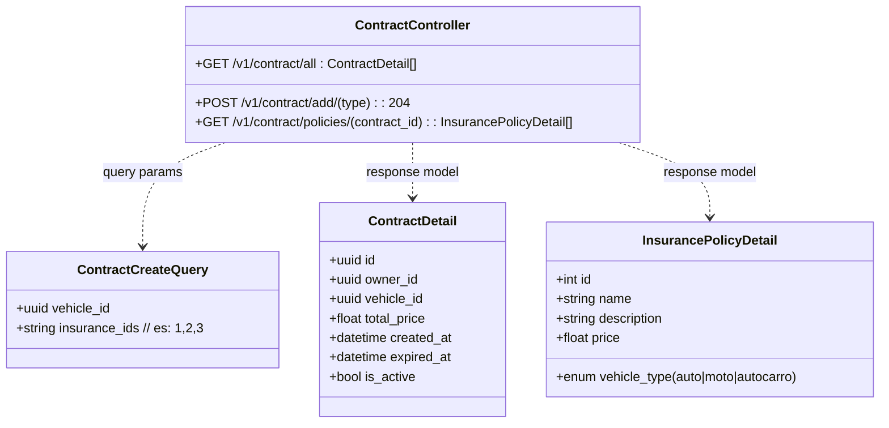

# Diagramma delle classi per vehicle-policy/v1/contract

```mermaid
classDiagram
  class ContractCreateQuery {
    +uuid vehicle_id
    +string insurance_ids  // es: 1,2,3
  }

  class ContractDetail {
    +uuid id
    +uuid owner_id
    +uuid vehicle_id
    +float total_price
    +datetime created_at
    +datetime expired_at
    +bool is_active
  }

  class InsurancePolicyDetail {
    +int id
    +string name
    +string description
    +float price
    +enum vehicle_type(auto|moto|autocarro)
  }

  class ContractController {
    +POST /v1/contract/add/(type) : 204
    +GET /v1/contract/all : ContractDetail[]
    +GET /v1/contract/policies/(contract_id) : InsurancePolicyDetail[]
  }

  ContractController ..> ContractCreateQuery : query params
  ContractController ..> ContractDetail : response model
  ContractController ..> InsurancePolicyDetail : response model
```
