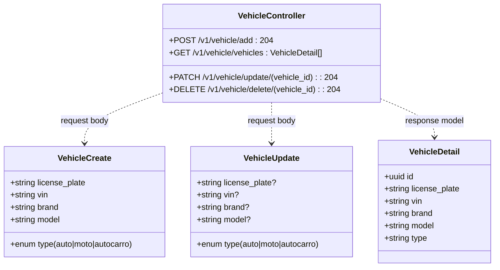

# Diagramma delle classi per vehicle-policy/v1/vehicle

```mermaid
classDiagram
  class VehicleCreate {
    +string license_plate
    +string vin
    +enum type(auto|moto|autocarro)
    +string brand
    +string model
  }

  class VehicleUpdate {
    +string license_plate?
    +string vin?
    +string brand?
    +string model?
    +enum type(auto|moto|autocarro)
  }

  class VehicleDetail {
    +uuid id
    +string license_plate
    +string vin
    +string brand
    +string model
    +string type
  }

  class VehicleController {
    +POST /v1/vehicle/add : 204
    +GET /v1/vehicle/vehicles : VehicleDetail[]
    +PATCH /v1/vehicle/update/(vehicle_id) : 204
    +DELETE /v1/vehicle/delete/(vehicle_id) : 204
  }

  VehicleController ..> VehicleCreate : request body
  VehicleController ..> VehicleUpdate : request body
  VehicleController ..> VehicleDetail : response model
```
