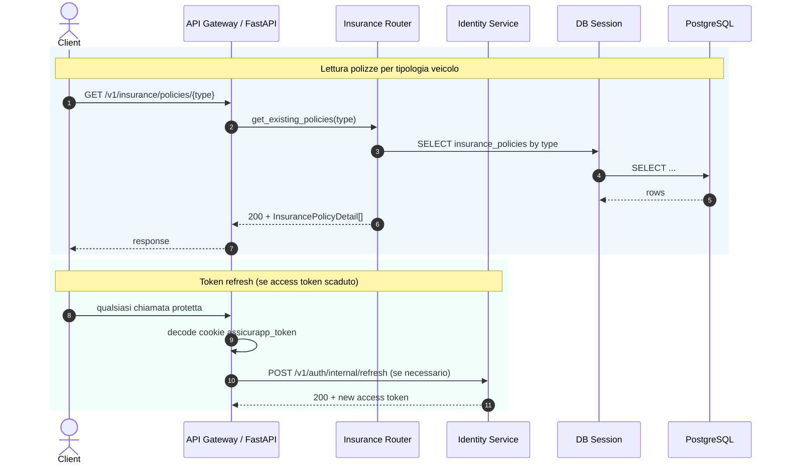

# Diagramma di frequenza per vehicle-policy/v1/insurance

```mermaid
sequenceDiagram
  autonumber
  actor Client
  participant API as API Gateway / FastAPI
  participant Ins as Insurance Router
  participant Auth as Identity Service
  participant DB as DB Session
  participant PG as PostgreSQL

  rect rgb(240, 248, 255)
    note over Client,PG: Lettura polizze per tipologia veicolo
    Client->>API: GET /v1/insurance/policies/{type}
    API->>Ins: get_existing_policies(type)
    Ins->>DB: SELECT insurance_policies by type
    DB->>PG: SELECT ...
    PG-->>DB: rows
    Ins-->>API: 200 + InsurancePolicyDetail[]
    API-->>Client: response
  end

  rect rgb(240, 255, 252)
    note over Client,Auth: Token refresh (se access token scaduto)
    Client->>API: qualsiasi chiamata protetta
    API->>API: decode cookie assicurapp_token
    API->>Auth: POST /v1/auth/internal/refresh (se necessario)
    Auth-->>API: 200 + new access token
  end
```
