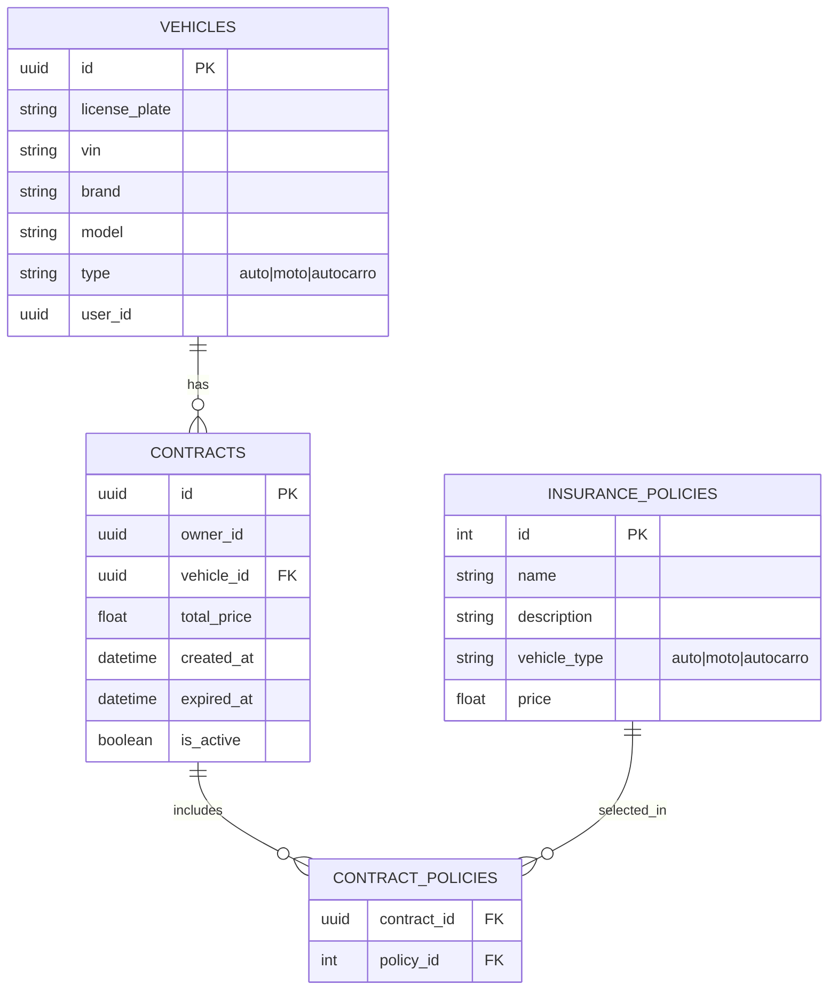

# Diagramma ER - Vehicle Policy Service

```mermaid
erDiagram
  VEHICLES ||--o{ CONTRACTS : has
  CONTRACTS ||--o{ CONTRACT_POLICIES : includes
  INSURANCE_POLICIES ||--o{ CONTRACT_POLICIES : selected_in

  VEHICLES {
    uuid id PK
    string license_plate
    string vin
    string brand
    string model
    string type "auto|moto|autocarro"
    uuid user_id
  }

  CONTRACTS {
    uuid id PK
    uuid owner_id
    uuid vehicle_id FK
    float total_price
    datetime created_at
    datetime expired_at
    boolean is_active
  }

  INSURANCE_POLICIES {
    int id PK
    string name
    string description
    string vehicle_type "auto|moto|autocarro"
    float price
  }

  CONTRACT_POLICIES {
    uuid contract_id FK
    int policy_id FK
  }
```
